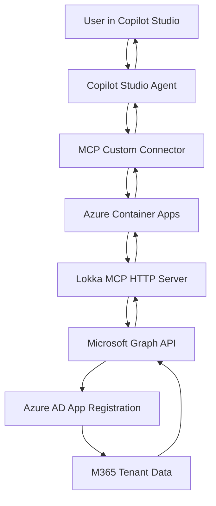
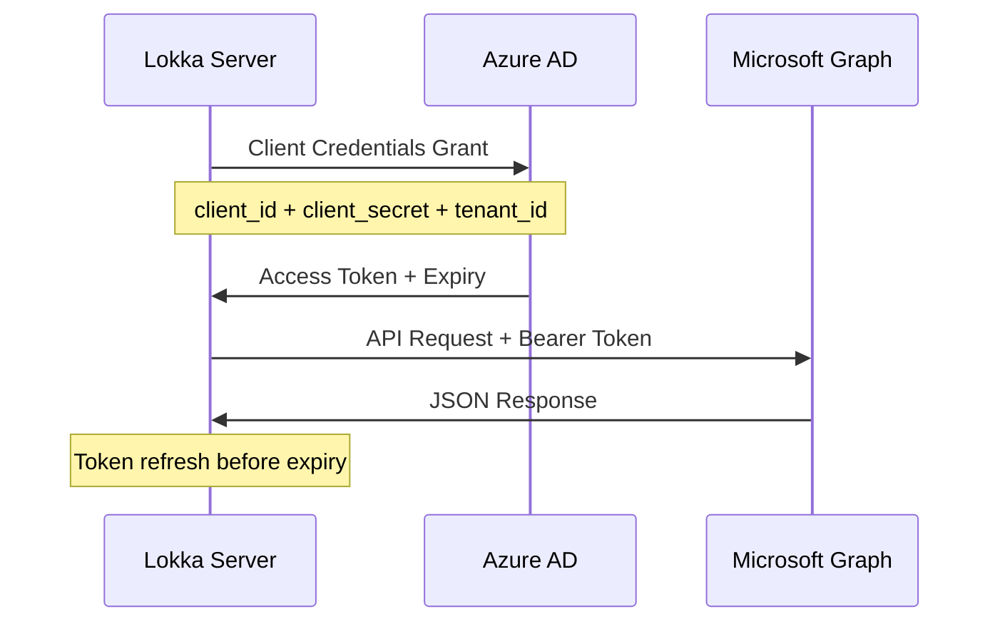

# Lokka MCP Server Integration Workflow

This document outlines the complete workflow of how the Lokka MCP (Model Context Protocol) server integration works with Microsoft Copilot Studio.

## Overview

The solution bridges Lokka's desktop-focused STDIO transport to HTTP transport compatible with Microsoft Copilot Studio's native MCP support, enabling seamless Microsoft Graph API access through conversational AI.

## Architecture Flow



## Detailed Component Flow

### 1. **User Interaction Layer**
- **User**: Asks questions in Copilot Studio chat interface
- **Examples**: 
  - "Show me all users in our organization"
  - "List all groups"
  - "Find users with manager John Doe"

### 2. **Copilot Studio Processing**
- **Copilot Agent**: Interprets user intent and determines if Microsoft Graph data is needed
- **Decision Engine**: Routes appropriate requests to MCP connector
- **Response Synthesis**: Combines MCP responses with natural language generation

### 3. **MCP Transport Layer**
```http
POST https://cg-lokka-mcp-server.redisland-4c6581fa.westus3.azurecontainerapps.io/mcp
Content-Type: application/json
Accept: application/json, text/event-stream

{
  "jsonrpc": "2.0",
  "method": "tools/call",
  "params": {
    "name": "Lokka-Microsoft",
    "arguments": {
      "apiType": "graph",
      "path": "/users",
      "method": "get",
      "queryParams": {"$top": "10", "$select": "displayName,mail"}
    }
  },
  "id": 1
}
```

### 4. **Azure Container Apps Infrastructure**
- **Load Balancer**: Distributes incoming requests
- **Container Instance**: Runs the modified Lokka MCP server
- **Auto Scaling**: Scales from 0-3 instances based on demand
- **Health Monitoring**: Continuous health checks on `/health` endpoint

### 5. **Lokka MCP HTTP Server**
- **Express.js Server**: Handles HTTP requests on port 3000
- **MCP Protocol Handler**: Processes JSON-RPC 2.0 requests
- **StreamableHTTPServerTransport**: Converts HTTP to MCP protocol
- **Authentication Manager**: Manages Azure AD client credentials flow

### 6. **Microsoft Graph API Integration**
- **Token Management**: Acquires and refreshes OAuth 2.0 tokens
- **API Abstraction**: Provides unified interface for Graph and Azure ARM APIs
- **Error Handling**: Manages rate limits, permissions, and API errors
- **Response Processing**: Formats Graph responses for MCP consumption

### 7. **Azure AD Authentication Flow**


## Technical Implementation Details

### Transport Layer Modification
**Original Lokka (STDIO)**:
```typescript
const transport = new StdioServerTransport();
await server.connect(transport);
```

**Modified Lokka (HTTP)**:
```typescript
const app = express();
app.use(express.json());

const transport = new StreamableHTTPServerTransport({
  sessionIdGenerator: undefined // stateless for Copilot Studio
});

await server.connect(transport);

app.post("/mcp", async (req, res) => {
  await transport.handleRequest(req, res, req.body);
});
```

### Available MCP Tools

#### 1. **Lokka-Microsoft Tool**
Primary tool for Microsoft Graph and Azure ARM API access:

```json
{
  "name": "Lokka-Microsoft",
  "description": "A versatile tool to interact with Microsoft APIs",
  "inputSchema": {
    "properties": {
      "apiType": {"enum": ["graph", "azure"]},
      "path": {"type": "string"},
      "method": {"enum": ["get", "post", "put", "patch", "delete"]},
      "queryParams": {"type": "object"},
      "body": {"type": "object"}
    }
  }
}
```

#### 2. **Authentication Management Tools**
- **get-auth-status**: Check current authentication status
- **set-access-token**: Update tokens (for delegated scenarios)
- **add-graph-permission**: Request additional scopes

### Request/Response Flow Example

#### Input (from Copilot Studio):
```json
{
  "jsonrpc": "2.0",
  "method": "tools/call",
  "params": {
    "name": "Lokka-Microsoft",
    "arguments": {
      "apiType": "graph",
      "path": "/users",
      "method": "get",
      "queryParams": {
        "$select": "displayName,userPrincipalName,mail",
        "$top": "5"
      }
    }
  },
  "id": 1
}
```

#### Processing Chain:
1. **HTTP Request** → Express.js server
2. **MCP Parsing** → StreamableHTTPServerTransport
3. **Tool Execution** → Lokka Microsoft Graph handler
4. **Authentication** → Client credentials token
5. **Graph API Call** → `GET https://graph.microsoft.com/beta/users`
6. **Response Processing** → Format for MCP
7. **HTTP Response** → Back to Copilot Studio

#### Output (to Copilot Studio):
```json
{
  "result": {
    "content": [{
      "type": "text",
      "text": "{\n  \"@odata.context\": \"https://graph.microsoft.com/beta/$metadata#users\",\n  \"value\": [\n    {\n      \"id\": \"5c7f62fa-eb6b-4938-947b-728681cebf78\",\n      \"displayName\": \"Global Admin\",\n      \"userPrincipalName\": \"Admin@Entisys360DemoLab.onmicrosoft.com\",\n      \"mail\": \"Admin@Entisys360DemoLab.onmicrosoft.com\"\n    }\n  ]\n}"
    }]
  },
  "jsonrpc": "2.0",
  "id": 1
}
```

## Environment Configuration

### Azure AD App Registration Requirements
```yaml
Authentication Type: Client Credentials Flow
Required Application Permissions:
  - User.Read.All
  - Group.Read.All  
  - Directory.Read.All
Admin Consent: Required
```

### Environment Variables
```bash
TENANT_ID=97a2ea10-9e96-48bc-b29c-71852ee16233
CLIENT_ID=1937e5aa-4a46-48a3-9913-48e76d85b1a8
# Do NOT commit real secrets. Use a local .env.
CLIENT_SECRET=<YOUR_CLIENT_SECRET>
USE_GRAPH_BETA=true
PORT=3000
```

### Container Configuration
```yaml
Image: cglokkareg.azurecr.io/lokka-mcp:http-native
Resources:
  CPU: 0.5 cores
  Memory: 1 GiB
Scaling: 0-3 replicas
Health Check: GET /health every 30s
```

## Integration Endpoints

### Production URLs
- **MCP Endpoint**: `https://cg-lokka-mcp-server.redisland-4c6581fa.westus3.azurecontainerapps.io/mcp`
- **Health Check**: `https://cg-lokka-mcp-server.redisland-4c6581fa.westus3.azurecontainerapps.io/health`

### Common API Patterns
```bash
# Get Users
{
  "apiType": "graph",
  "path": "/users",
  "method": "get",
  "queryParams": {"$select": "displayName,mail", "$top": "10"}
}

# Get Groups
{
  "apiType": "graph", 
  "path": "/groups",
  "method": "get",
  "queryParams": {"$select": "displayName,description"}
}

# Search Users
{
  "apiType": "graph",
  "path": "/users",
  "method": "get", 
  "queryParams": {"$filter": "startswith(displayName,'John')"}
}

# Get User's Manager
{
  "apiType": "graph",
  "path": "/users/{user-id}/manager",
  "method": "get"
}
```

## Error Handling Workflow

### Authentication Errors
```yaml
403 Forbidden: 
  Cause: Insufficient permissions
  Solution: Grant admin consent for required permissions

401 Unauthorized:
  Cause: Invalid credentials or expired token
  Solution: Check app registration credentials

400 Bad Request:
  Cause: Invalid API request format
  Solution: Verify API path and parameters
```

### Rate Limiting
```yaml
429 Too Many Requests:
  Cause: Microsoft Graph rate limits exceeded
  Mitigation: Built-in retry logic with exponential backoff
```

## Deployment Workflow

### 1. Infrastructure Setup (Terraform)
```bash
cd terraform
terraform init
terraform plan -var-file="terraform.tfvars"
terraform apply
```

### 2. Container Build & Deploy
```bash
az acr build --registry cglokkareg \
  --image lokka-mcp:http-native . \
  --file Dockerfile.lokka-http-clean \
  --resource-group "Devon_Streelman_test"
```

### 3. Service Verification
```bash
# Health Check
curl https://cg-lokka-mcp-server.redisland-4c6581fa.westus3.azurecontainerapps.io/health

# MCP Tool List
curl -X POST https://cg-lokka-mcp-server.redisland-4c6581fa.westus3.azurecontainerapps.io/mcp \
  -H "Content-Type: application/json" \
  -H "Accept: application/json, text/event-stream" \
  -d '{"jsonrpc":"2.0","method":"tools/list","id":1}'
```

## Monitoring & Observability

### Health Monitoring
```json
GET /health
Response: {
  "status": "healthy",
  "service": "lokka-mcp-http", 
  "timestamp": "2025-08-21T17:33:53.256Z"
}
```

### Authentication Status
```json
POST /mcp
{
  "method": "tools/call",
  "params": {
    "name": "get-auth-status",
    "arguments": {}
  }
}

Response: {
  "authMode": "client_credentials",
  "isReady": true,
  "tokenStatus": {
    "isExpired": false,
    "expiresOn": "2025-08-21T18:55:22.000Z"
  }
}
```

### Azure Container Apps Logs
```bash
az containerapp logs show \
  --name cg-lokka-mcp-server \
  --resource-group "Devon_Streelman_test" \
  --follow
```

## Security Considerations

### Network Security
- **HTTPS Only**: All communication encrypted in transit
- **Azure Container Apps**: Managed network security
- **No Open Ports**: Only HTTP/HTTPS ingress allowed

### Authentication Security  
- **Client Credentials**: No user credentials stored
- **Token Lifecycle**: Automatic token refresh
- **Least Privilege**: Only required Graph permissions granted

### Secret Management
- **Azure Container Apps Secrets**: Environment variables encrypted
- **No Hardcoded Secrets**: All secrets injected at runtime
- **Token Storage**: In-memory only, not persisted

## Troubleshooting Guide

### Common Issues

#### 1. Permission Errors
**Symptom**: `403 Insufficient privileges`
**Solution**: 
- Verify Application permissions (not Delegated)
- Ensure admin consent granted
- Check specific permission requirements for API endpoint

#### 2. Authentication Failures  
**Symptom**: `401 Unauthorized`
**Solution**:
- Verify TENANT_ID, CLIENT_ID, CLIENT_SECRET
- Check app registration is not expired
- Ensure client secret is not expired

#### 3. Container Startup Issues
**Symptom**: Container fails to start
**Solution**:
- Check Azure Container Apps logs
- Verify environment variable configuration
- Check image build succeeded

#### 4. MCP Protocol Errors
**Symptom**: Invalid JSON-RPC responses
**Solution**:
- Verify Content-Type: application/json
- Include Accept: application/json, text/event-stream
- Check JSON-RPC 2.0 format compliance

## Performance Characteristics

### Response Times
- **Authentication**: ~200ms (cached tokens)
- **Simple Graph Query**: ~500-1500ms
- **Complex Graph Query**: ~1-5s (depends on data size)
- **Container Cold Start**: ~10-15s

### Scalability
- **Auto-scaling**: 0-3 instances
- **Concurrent Requests**: ~100 per instance
- **Rate Limits**: Respects Microsoft Graph throttling
- **Memory Usage**: ~200-500MB per instance

## Future Enhancements

### Potential Improvements
1. **Caching Layer**: Redis cache for frequently accessed data
2. **Batch Operations**: Support for Microsoft Graph batch APIs
3. **Webhook Support**: Real-time updates from Microsoft Graph
4. **Advanced Filtering**: More sophisticated query builders
5. **Audit Logging**: Detailed request/response logging
6. **Multi-Tenant**: Support for multiple Azure AD tenants

### Monitoring Enhancements
1. **Application Insights**: Detailed telemetry and monitoring
2. **Custom Metrics**: Track API usage patterns
3. **Alerting**: Automated alerts for failures
4. **Performance Dashboards**: Real-time performance monitoring

## Conclusion

This workflow demonstrates a complete end-to-end integration between Microsoft Copilot Studio and Microsoft Graph APIs through the Lokka MCP server. The solution provides:

- **Seamless Integration**: Native MCP support in Copilot Studio
- **Robust Authentication**: Client credentials flow with proper permissions
- **Scalable Infrastructure**: Auto-scaling Azure Container Apps
- **Comprehensive API Access**: Full Microsoft Graph and Azure ARM API support
- **Production Ready**: Health monitoring, error handling, and security best practices

The architecture enables natural language interactions with Microsoft 365 data through conversational AI while maintaining enterprise security and scalability requirements.
